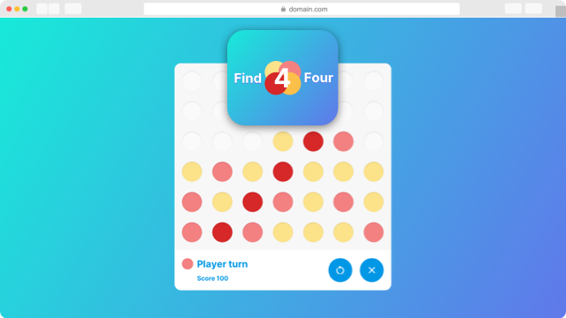

# connect-four

The **Find-Four game** (a.k.a. [*The Captain's Mistress* 🤯](http://www.lightlink.com/history/uk/products/027.html)) is
a two-player connection board game, in which the players choose a color and then take turns dropping colored tokens into
a **seven-column**, **seven-row vertically** grid. The pieces fall straight down, occupying the lowest available space
within the column. The objective of the game is to be the first to form a horizontal, vertical, or diagonal line of
**four of one's own tokens**.

## How it works?

Our webapp will allow the user to start a new game by choosing between **playing alone** or **against another friend**.
In case of playing alone, the machine will do random movements without taking care of how the board is or their chances
to win.

The app will maintain the scorecard of the current user until the app is running or the game is reset by the user to
start a new one.

